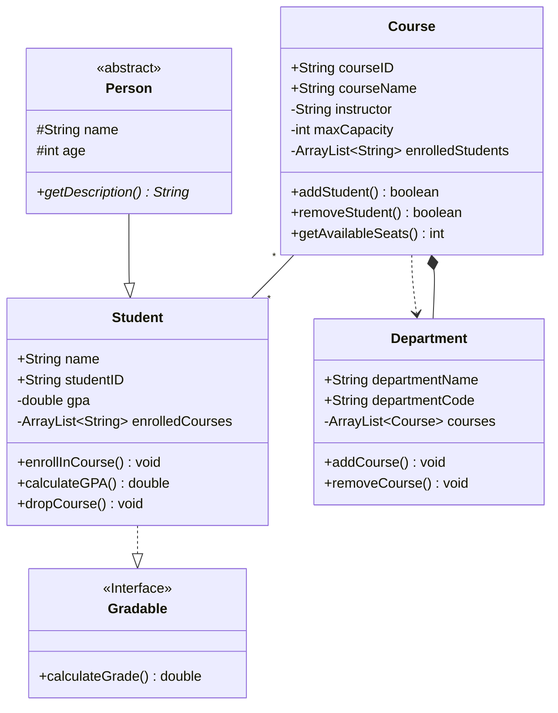

# assign1git
mitchell/mallen40
First comment
More First comments

This is a change on newbranch
test branch change

```mermaid
classDiagram
class Student {
    +String name
    +String studentID
    -double gpa
    -ArrayList~String~ enrolledCourses
    +enrollInCourse() void
    +calculateGPA() double
    +dropCourse() void
}
class Course {
    +String courseID
    +String courseName
    -String instructor
    -int maxCapacity
    -ArrayList~String~ enrolledStudents
    +addStudent() boolean
    +removeStudent() boolean
    +getAvailableSeats() int
}
class Person {
    <<abstract>>
    #String name
    #int age
    +getDescription() String*
}
class Gradable {
    <<Interface>>
    +calculateGrade() double
}
class Department {
    +String departmentName
    +String departmentCode
    -ArrayList~Course~ courses
    +addCourse() void
    +removeCourse() void
}
Course "*" -- "*" Student
Department --* Course
Course ..> Department
Student ..|> Gradable
Person --|> Student
%%Generated by Astah mermaid plugin
```

